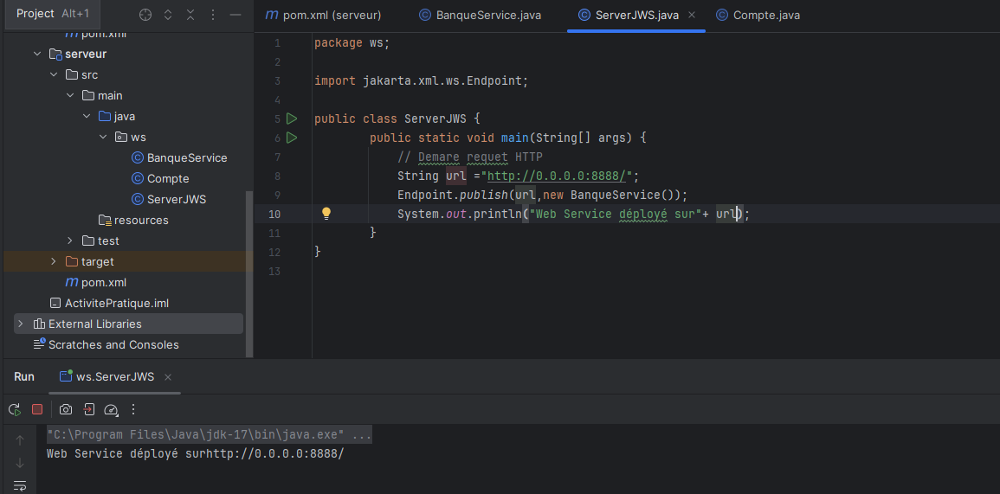
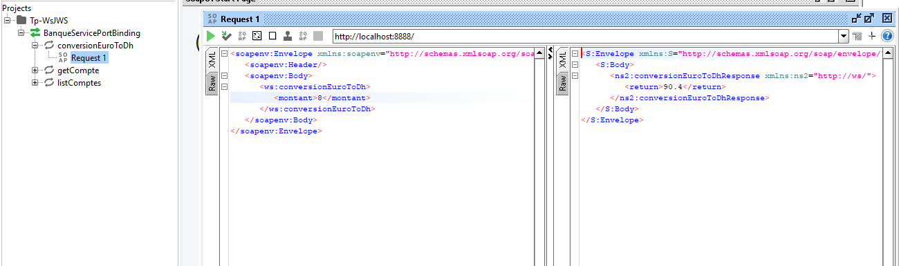
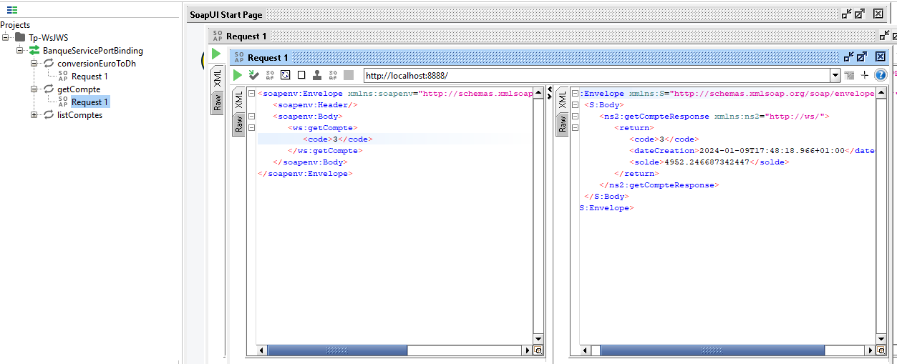
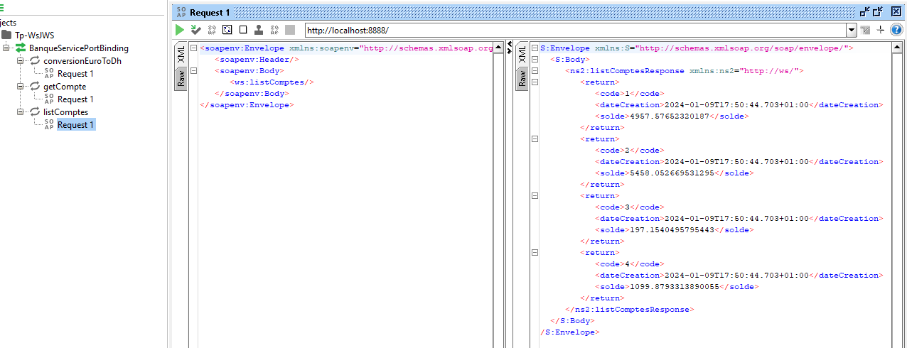

<h3>Activité Pratique Tp Web services SOAP UDDI</h3>

Capture pour tester le Web Service est-ce qu'il est déployé ou pas :

Capture pour tester la methode conversion Euro to DH :

Capture pour visualiser le compte d'un client passé en paramètre :

Capture pour consulter la liste des Comptes :

